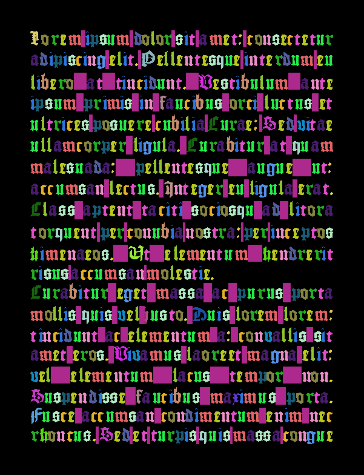

# Text dataset generator

Installation of packages needed for running:

``pip install PILLOW, numpy, freetype-py, opencv-python, noise, lxml``
or run command
``pip install -r requirements.txt``

How to run the script:  
``text_dataset_generator.py [-h] -c CONFIG``  

Example:  
``python text_dataset_generator.py -c config.ini``
  

Example pagexml input is located at [Doc/pagexml.xml](Doc/pagexml.xml)
Example annotations output is located at [Doc/annotations.txt](Doc/annotations.txt)
