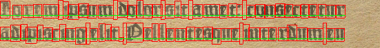

# Text dataset generator

Installation of packages needed for running:

``pip install PILLOW, numpy, freetype-py, opencv-python, noise, lxml``
or run command
``pip install -r requirements.txt``

How to run the script:  
``text_dataset_generator.py [-h] -c CONFIG``  

Example:  
``python text_dataset_generator.py -c config.ini``

## Image examples
Here are shown examples of generated images. These are just strips, originals with full resolution are located at [Doc/ImageExamples](Doc/ImageExamples).
#### Generated image 

#### Generated image with bounding boxes

#### Semantic data associted with generated image (Grayscale)

#### Semantic data associted with generated image (Colored)

### Image metadata
Example pagexml output is located at [Doc/pagexml.xml](Doc/pagexml.xml)

Example annotations output is located at [Doc/annotations.txt](Doc/annotations.txt)
